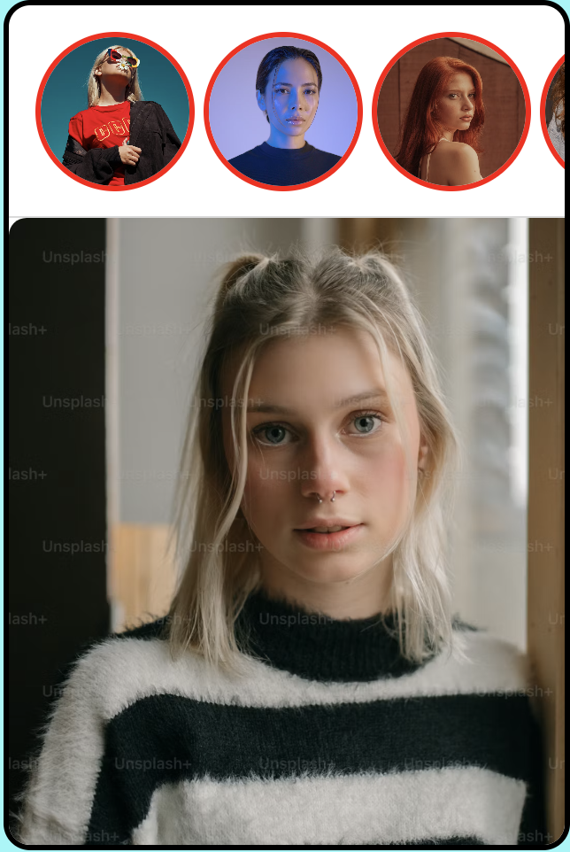

# Instagram Story & Like Clone

Instagram Story & Like Clone is a web-based project that replicates the popular Instagram features of viewing stories and liking posts. This project demonstrates the use of HTML, CSS, and JavaScript to create an interactive and visually appealing user experience.

---

## Preview



## 🌟 Features

- **Story Viewer**:  
  Users can click on profile pictures to view full-screen stories. Each story is displayed for 3 seconds before returning to the main interface.

- **Double-Tap Like Animation**:  
  Users can double-tap on the image to trigger a heart animation, mimicking Instagram's like feature.

- **Responsive Design**:  
  The layout is optimized for various screen sizes, ensuring a seamless experience on both desktop and mobile devices.

---

## 📖 How It Works

1. **Story Viewer**:  
   - Profile pictures are displayed in a horizontal scrollable bar.  
   - Clicking on a profile picture opens the corresponding story in full-screen mode.  
   - The story automatically closes after 3 seconds.

2. **Like Feature**:  
   - Double-tapping on the image triggers a heart animation at the center of the image.  
   - The animation fades out smoothly after a short duration.

---

## 🛠️ Technologies Used

- **HTML5**: For structuring the web page.
- **CSS3**: For styling and animations.
- **JavaScript (ES6)**: For interactivity and dynamic content rendering.

---

## 📂 Project Structure
Instagram Story & Like Clone/ ├── index.html # Main HTML file ├── style.css # CSS file for styling ├── script.js # JavaScript file for functionality └── assets/ # Folder containing images (if applicable)


---

## 🚀 How to Run the Project

**1. Clone the Repository:**
   ```bash
   git clone https://github.com/your-username/instagram-story-like-clone.git

**2. Navigate to the Project Directory:**
    cd instagram-story-like-clone

**3. Open the Application:**
    Open the index.html file in any modern web browser.


## 📈 Future Enhancements
    Add a progress bar for stories to indicate the remaining time.
    Implement swipe gestures for navigating between stories.
    Add a backend to store and retrieve user stories dynamically.

## 📝 License
    This project is open-source and available under the MIT License.

##👨‍💻 About the Developer
    Hi, I'm Aryan Raj, a passionate web developer with a keen interest in building interactive and user-friendly web applications. Feel free to connect with me on LinkedIn or check out my other projects on GitHub.

## ⭐ Acknowledgments
    Remix Icon: For providing the heart icon used in the like animation.
    Unsplash: For the beautiful images used in the project.
    Inspiration from Instagram's story and like features.